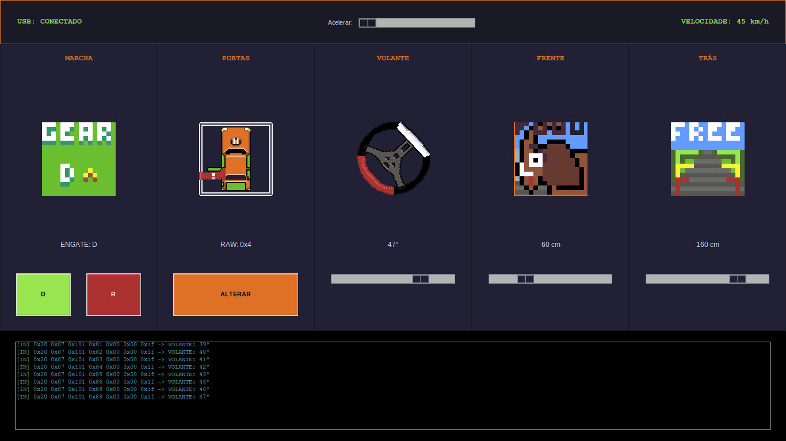
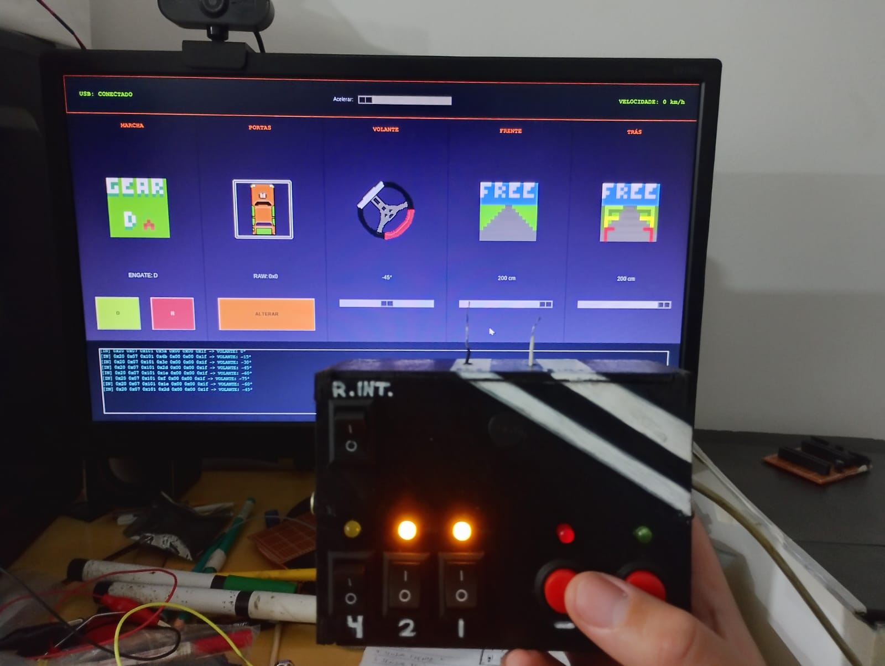
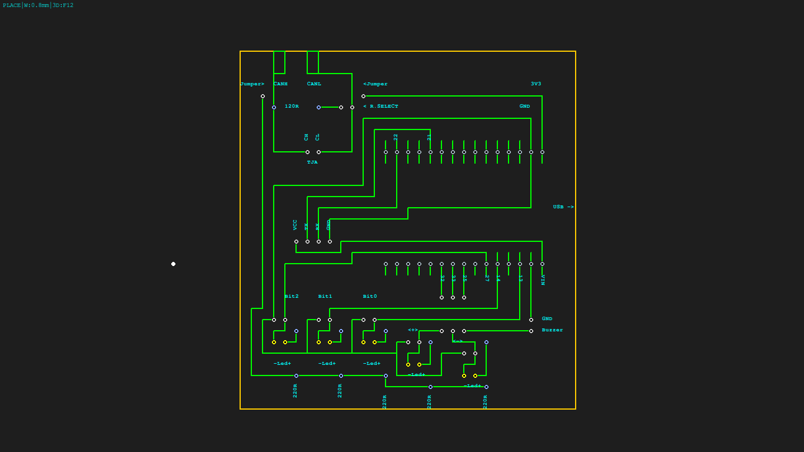
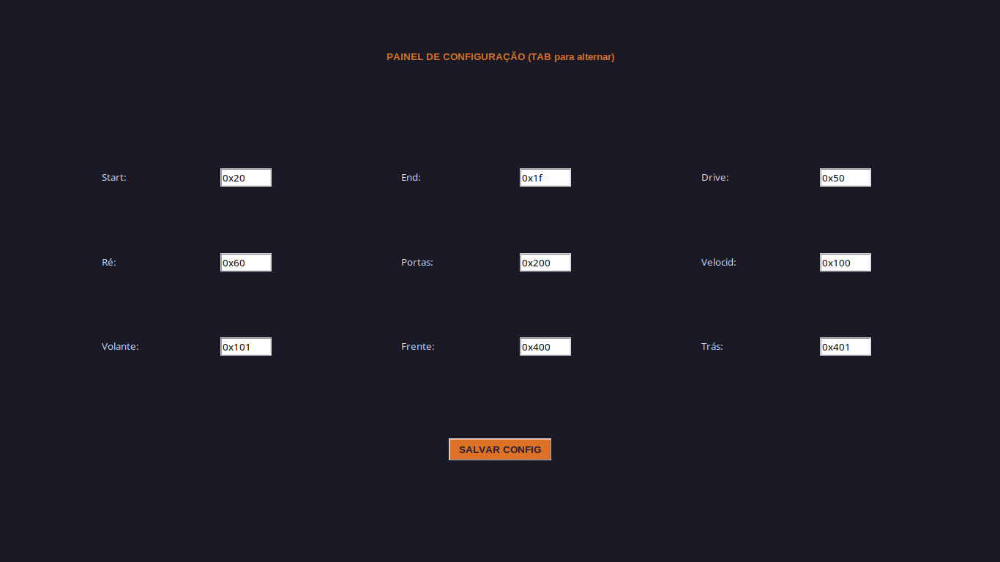
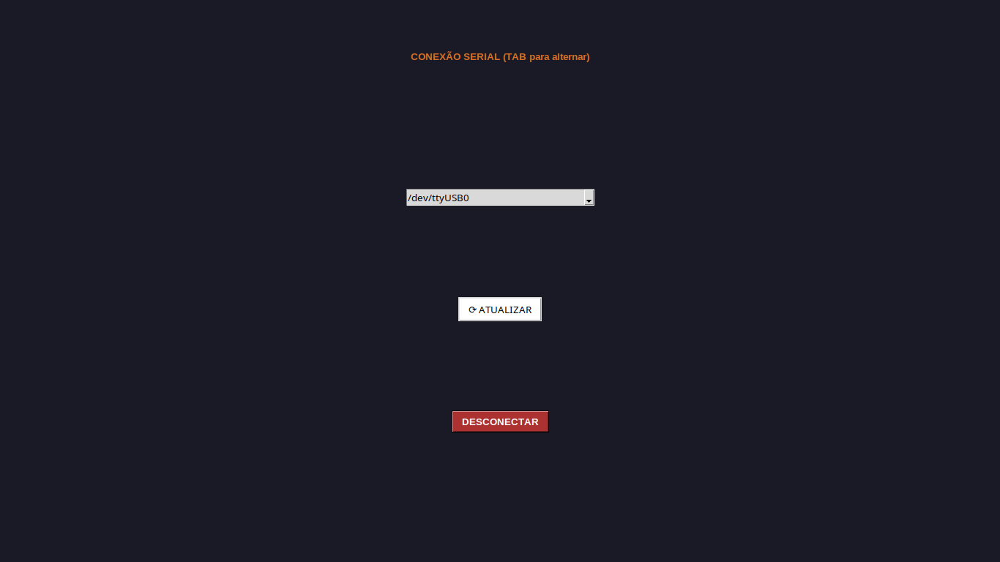

readme_content = """# 🚗 ADAS Cyberdeck — Diagnostic & Simulation Tool

Um ecossistema completo de diagnóstico, sniffer e simulação de barramento CAN automotivo com uma estética **Retro Pixel Art **. Este projeto foi projetado sob medida para rodar em computadores portáteis, terminais retro e Cyberdecks, integrando uma aplicação em loop de animação com injeção física de dados através de um ecossistema de hardware robusto baseado no ESP32.

---

## 📷 Demonstração Visual

### 1. Painel Principal (Dashboard ADAS)
A tela principal exibe o estado do veículo em tempo real, renderizando os sprites com interpolação limpa e respeitando o limite estético de frames por segundo.

### 2. Painel de Controle Físico (Hardware HIL)
O console de engenharia automotiva construído sobre uma placa de circuito impressa artesanal e acondicionado em uma carcaça de MDF envernizado e "decorado", conferindo o visual clássico de um equipamento industrial cyberpunk.

### 3. Confecção da placa de circuito impresso
Utilizei meu software proprietário(Em breve no github) para desenhar as trilhas de nosso hardware.

### 4. Configuração de Matriz e Identificadores CAN
Interface dedicada para remapeamento dinâmico de IDs de rede, bytes de início/fim e sincronização dos nós sem necessidade de recompilar o código fonte.

### 5. Gerenciamento de Conexão Serial USB
Módulo de varredura automática de portas seriais (`pyserial`) para acoplamento do nó físico (ESP32) à interface gráfica do Cyberdeck.

---

## ✨ Funcionalidades Principais

* **UX/UI Brutalista & Retro:** Interface renderizada de forma síncrona a **5 FPS** cravados. Essa limitação artificial de frames atua diretamente no charme das animações pixeladas e, milagrosamente, otimizou a fila de interrupções de hardware da caixinha de controle.
* **Máscara de Bits Dinâmica (BCM):** Motor de renderização que utiliza composição alfa gráfica (*Alpha Composite*) para empilhar dinamicamente os sprites das portas sobre o chassi do veículo. O estado é controlado por um único byte de payload CAN através de operadores bitwise (ex: `0x3F` ativa instantaneamente as 4 portas, porta-malas e bocal de combustível).
* **Injeção de Sinais Dinâmicos (HIL):** Chaves físicas multiplexadas geram tráfego em tempo real no barramento físico, simulando perfeitamente o comportamento de sensores ultrassônicos de estacionamento, sensores de guinada do volante e gerenciamento de tração (Drive/Ré).
* **Contador Geiger Acústico (Radar de Proximidade):** O buzzer passivo é controlado sem o uso de timers complexos ou bibliotecas pesadas de PWM, utilizando manipulação direta de nível lógico (*bit-banging*) operando na escala dos microssegundos (`ets_delay_us`) para gerar estalos secos cujo atraso diminui exponencialmente conforme o obstáculo se aproxima, emulando um sensor radioativo ou o radar tático de *Alien*.
* **Sniffer de Barramento Integrado:** Um terminal de monitoramento integrado na parte inferior traduz os frames binários seriais recebidos em mensagens estruturadas contendo *Start Byte*, *DLC*, *CAN ID*, *Payload Hexadecimal* e *End Byte*.

---

## 🗺️ Arquitetura de Hardware e Pinout (ESP32)

O circuito utiliza resistores de *Pull-up* internos configurados via firmware no ESP-IDF, simplificando a malha de conexões na placa. O transceptor CAN TJA1050 está configurado no modo **`TWAI_MODE_NO_ACK`**, permitindo que o nó dispare os pacotes elétricos no barramento diferencial sem travar por falta de um segundo nó físico na bancada.

| Componente | Pino ESP32 (GPIO) | Tipo de Sinal | Conexão Física / Notas |
| :--- | :---: | :---: | :--- |
| **TJA1050 TX** | `GPIO 21` | Saída Digital | Transmissor do Controlador CAN |
| **TJA1050 RX** | `GPIO 22` | Entrada Digital | Receptor do Controlador CAN |
| **TJA1050 VCC** | `5V / VIN` | Alimentação | **Atenção:** Requer 5V para correta amplitude diferencial CAN H/L |
| **Slide Switch 1** | `GPIO 13` | Entrada (Pull-up) | Bit 0 da seleção de Ferramenta Binária |
| **Slide Switch 2** | `GPIO 14` | Entrada (Pull-up) | Bit 1 da seleção de Ferramenta Binária |
| **Slide Switch 3** | `GPIO 27` | Entrada (Pull-up) | Bit 2 da seleção de Ferramenta Binária |
| **Botão MAIS (+)** | `GPIO 32` | Entrada (Pull-up) | Pulso p/ GND ativa Incremento / Ação A |
| **Botão MENOS (-)** | `GPIO 33` | Entrada (Pull-up) | Pulso p/ GND ativa Decremento / Ação B |
| **Buzzer Passivo** | `GPIO 25` | Saída Digital | Atuador acústico do Contador Geiger |

### Tabela de Seleção Multiplexada das Ferramentas:
Combinando o estado físico das 3 chaves seletoras (Slide Switches), o ESP32 altera internamente sua máquina de estados para mapear quais variáveis os botões de ação irão comandar:
* `001` (Apenas Chave 1 em GND) $\rightarrow$ **Marcha** (Botão + engata Drive, Botão - engata Ré)
* `010` (Apenas Chave 2 em GND) $\rightarrow$ **Portas BCM** (Cicla a abertura sequencial de camadas)
* `011` (Chaves 1 e 2 em GND) $\rightarrow$ **Volante** (Altera o ângulo de esterçamento)
* `100` (Apenas Chave 3 em GND) $\rightarrow$ **Sensor Frontal** (Aproxima o obstáculo e inicia o clique Geiger)
* `101` (Chaves 1 e 3 em GND) $\rightarrow$ **Sensor Traseiro** (Aproxima o hidrante traseiro)
* `110` (Chaves 2 e 3 em GND) $\rightarrow$ **Velocidade** (Incrementa o velocímetro digital do painel)

---

## 💻 Como Executar o Ecossistema

### 1. Interface Gráfica (Cyberdeck / PC)
Certifique-se de ter o Python 3 e o gerenciador de pacotes configurados.
